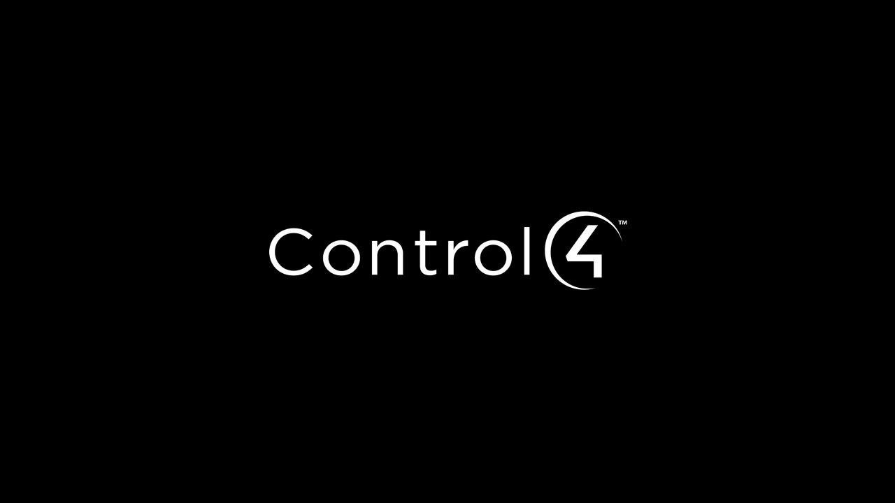
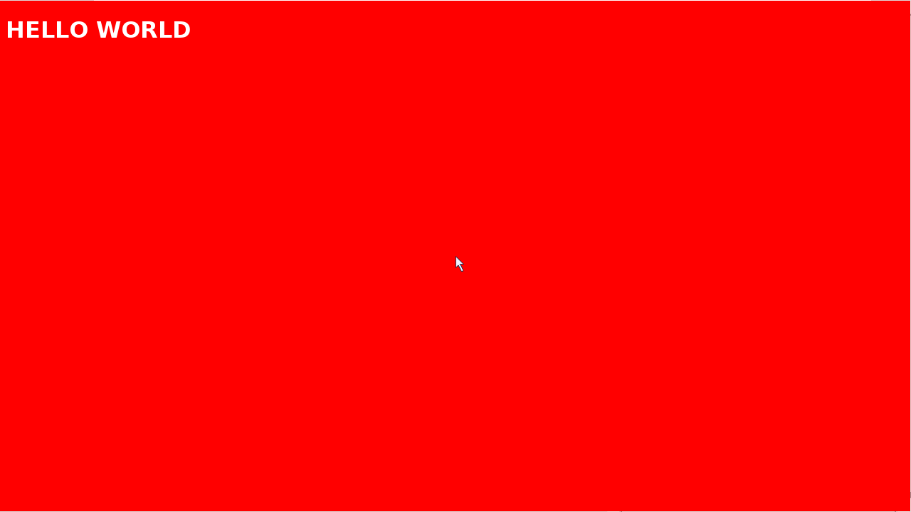
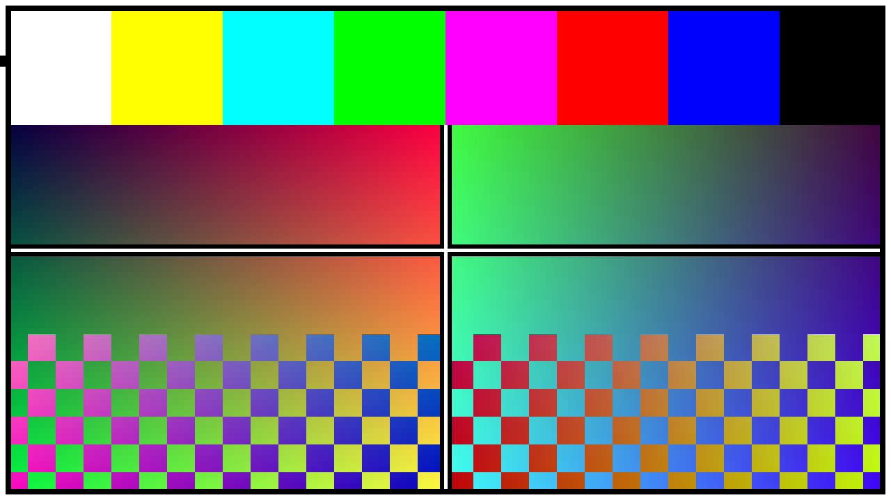

# HC800 Kiosk

> Display any webpage on the HDMI output of a **Control4 HC800** home controller via a simple REST API — no X11, no Chromium, no cloud.


*The Control4 boot screen, captured directly from `/dev/fb0` (1280×720 BGRX)*

---

## What this is

This project turns the HC800's unused HDMI output into a kiosk display. You POST a URL to a tiny Node.js API running on the device, and the page appears on screen within a few seconds.

```bash
curl -X POST http://192.168.1.147:8099/api/url \
     -H "Content-Type: application/json" \
     -d '{"url":"http://192.168.1.147/c4kiosk/"}'
```

A clean web control panel (served from the HC800 itself) lets you type URLs, push test patterns, and see a live capture of the framebuffer — all in the browser.


*Full-screen kiosk mode. No toolbar, no scrollbars, no status bar. 1280×720.*

---

## Hardware

| | |
|---|---|
| **Device** | Control4 HC-800 |
| **CPU** | Intel Atom D525 (32-bit x86) |
| **OS** | BusyBox Linux, kernel 3.16.38, glibc 2.19 |
| **Display** | 1280×720 via HDMI, framebuffer at `/dev/fb0` (inteldrmfb) |
| **Pixel format** | BGRX — 4 bytes/pixel, B at lowest address |
| **Node.js** | v10 (built-in, at `/usr/bin/node`) |
| **No** | X11, GPU acceleration, VT console, gcc |

---

## How it works

### The browser

There is no Chromium, Electron, or headless Chrome. Instead this uses **NetSurf-FB 3.2** from Debian Jessie i386 — a lightweight browser that renders HTML/CSS directly to a Linux framebuffer via SDL. It needs no display server.

NetSurf writes its pixels to `/dev/fb0`, which is wired to the HDMI output via `inteldrmfb`. Whatever NetSurf draws appears on screen.

```
Node.js API (port 8099)
    └── spawn  /mnt/internal/browser/launch.sh  "http://..."
                   └── LD_PRELOAD=fake-vt-shim.so
                       SDL_VIDEODRIVER=fbcon
                       SDL_FBDEV=/dev/fb0
                       netsurf-fb "http://..."
                           └── renders HTML → writes pixels → /dev/fb0 → HDMI
```

### The VT shim

The HC800 uses `inteldrmfb` and has **no VT console** — there is no `/dev/tty0`, no virtual terminal subsystem. NetSurf's SDL fbcon backend calls VT/KD `ioctl`s on startup (`VT_OPENQRY`, `VT_ACTIVATE`, `KDSETMODE`, etc.) and crashes when they fail with `ENOTTY`.

`fake-vt-shim.so` is an `LD_PRELOAD` library that intercepts these ioctls and returns safe values. It also strips `SDL_FULLSCREEN | SDL_HWSURFACE | SDL_DOUBLEBUF` from `SDL_SetVideoMode` (which would fail on inteldrmfb) and forces `SDL_SWSURFACE`.

The HC800 has no gcc, so `fake-vt-shim.so` is **pre-compiled** for 32-bit x86 Linux using a Debian Stretch i386 Docker container on a modern Mac/Linux machine:

```bash
docker run --rm --platform linux/386 \
  -v "$(pwd)/kiosk:/work" i386/debian:stretch \
  bash -c "apt-get update -qq && apt-get install -y -qq gcc libsdl1.2-dev && \
    gcc -shared -fPIC -O2 -o /work/fake-vt-shim.so /work/fake-vt-shim.c \
    -ldl -D_GNU_SOURCE"
```

### The kiosk Choices file

NetSurf reads `~/.netsurf/Choices` for configuration. Three settings remove all browser chrome:

```
fb_toolbar_size:1
fb_furniture_size:1
fb_toolbar_layout:
```

`fb_toolbar_layout:` with an empty value hides all buttons. `fb_toolbar_size:1` and `fb_furniture_size:1` collapse the toolbar and scrollbar areas to 1 pixel.

**Critical:** The API process runs with `HOME=/`. Without `export HOME=/root` in `launch.sh`, NetSurf looks for `/.netsurf/Choices` (doesn't exist) and falls back to defaults — showing the full browser chrome at ~1280×650 instead of 1280×720.

### HTML charset requirement

NetSurf 3.2 requires a charset declaration. Without it, the page renders as a **white blank** with `BadEncoding` in the status bar.

Every page you intend to display **must** include one of:
- `<meta charset="UTF-8">` in the `<head>`
- `Content-Type: text/html; charset=UTF-8` HTTP header

### HTTPS

The HC800's `libssl` is very old. NetSurf 3.2 cannot connect to modern HTTPS servers. **Use plain HTTP** for URLs you intend to display, served by a local web server. Alternatively, run an HTTP reverse proxy on the same network.

---

## Quick start

### Requirements

- macOS or Linux machine on the same network as the HC800
- `sshpass` installed (`brew install sshpass`)
- The HC800 SSH credentials (default: `root` / check your system)

### 1. Clone

```bash
git clone https://github.com/yourusername/C4HC800-kiosk
cd C4HC800-kiosk
```

### 2. Deploy

```bash
HC800_HOST=192.168.1.x HC800_PASS=yourpassword bash scripts/deploy.sh
```

This will:
1. Upload all kiosk files to `/www/c4kiosk/` on the HC800
2. Run `install-browser.sh` on the device (~30 MB download, takes 1–3 min)
3. Register and start the API as an init.d service

### 3. Open the control panel

```
http://192.168.1.x/c4kiosk/
```

Enter a URL and click **Display**. The page will appear on the HC800's HDMI output.

---

## Control panel

The web GUI lives at `http://HC800_IP/c4kiosk/` and is served by the HC800's built-in web server (nginx/lighttpd on port 80).

**Features:**
- **Live preview** — fetches the raw framebuffer (`/api/capture.raw`) and decodes it (BGRX → RGBA) on a canvas. Click Refresh to capture.
- **URL bar** — type any URL and press Display (or Enter)
- **Test Pattern** — writes a color bars + gradient pattern directly to `/dev/fb0`
- **C4 Boot Screen** — restores the Control4 logo frame captured on first boot
- **Blank Screen** — all black
- **Stop Browser** — kills the NetSurf-FB process

---

## API reference

All endpoints are on port **8099**. CORS is open (`*`).

| Method | Path | Description |
|--------|------|-------------|
| `GET`  | `/api/status` | Full system status (browser, fb0, config, uptime) |
| `POST` | `/api/url` | `{ "url": "http://..." }` — launch browser and display URL |
| `POST` | `/api/browser/stop` | Kill the browser process |
| `POST` | `/api/display/wake` | Re-assert 1280×720 mode, unblank fb0, and enable the HDMI transmitter signal |
| `GET`  | `/api/capture.raw` | Raw 1280×720 BGRX framebuffer dump (3,686,400 bytes) |
| `POST` | `/api/test` | Write color test pattern to fb0 |
| `POST` | `/api/black` | Write all-black frame to fb0 |
| `POST` | `/api/restore-logo` | Restore the saved C4 boot screen to fb0 |
| `POST` | `/api/frame` | Write a raw BGRX frame (body = 3,686,400 bytes) |
| `GET`  | `/api/config` | Current config |
| `POST` | `/api/config` | Update config (`{ "url": "...", "enabled": true }`) |

### Examples

```bash
# Display a URL
curl -X POST http://HC800:8099/api/url \
     -H "Content-Type: application/json" \
     -d '{"url":"http://192.168.1.x/my-page.html"}'

# Get status
curl http://HC800:8099/api/status

# Capture framebuffer as PNG (requires Python + Pillow)
curl -s http://HC800:8099/api/capture.raw | python3 -c "
from PIL import Image; import sys
data = sys.stdin.buffer.read()
img = Image.frombytes('RGBX', (1280, 720), data, 'raw', 'BGRX').convert('RGB')
img.save('screenshot.png')
print('Saved screenshot.png')
"

# Write test pattern
curl -X POST http://HC800:8099/api/test

# Stop browser
curl -X POST http://HC800:8099/api/browser/stop
```

---

## File layout

```
C4HC800-kiosk/
├── kiosk/
│   ├── api.js              Node.js REST API (runs on HC800, no npm deps)
│   ├── index.html          Web control panel GUI
│   ├── install-browser.sh  On-device installer (runs via SSH)
│   ├── fake-vt-shim.c      VT/KD ioctl shim — source
│   ├── fake-vt-shim.so     Pre-compiled i386 binary (Debian Stretch)
│   ├── config.json         Default API config
│   ├── start-api.sh        Start the API (called by init.d)
│   ├── stop-api.sh         Stop the API
│   └── c4kiosk-init.sh     SysV init.d service script
├── scripts/
│   └── deploy.sh           Deploy to HC800 and run installer
└── docs/
    └── screenshots/
        ├── c4-boot-screen.png         HC800 HDMI at boot (captured from fb0)
        ├── kiosk-mode-hello-world.png  Full-screen kiosk, no chrome
        ├── browser-with-toolbar.png    Browser before kiosk mode tuning
        └── test-pattern.png            Color bars test pattern on display
```

---

## install-browser.sh in detail

This script runs on the HC800 itself (via SSH). It has no dependencies other than `wget`, `dpkg`, `gunzip`, and `awk` — all present in BusyBox.

**Steps:**
1. Downloads `netsurf-fb_3.2+dfsg-2+b1_i386.deb` from archive.debian.org
2. Downloads `netsurf-common_3.2+dfsg-2_all.deb` (resources, CSS, icons)
3. Extracts both into `/mnt/internal/browser/`
4. Downloads the Debian Jessie i386 package index
5. Installs all missing shared libraries (`libsdl`, `libxcb*`, `libmozjs185`, `libx11`, etc.) into `/mnt/internal/browser/lib/`
6. Fixes a broken `libpng12.so.0` symlink
7. Installs DejaVu fonts (required for text rendering)
8. Copies the pre-compiled `fake-vt-shim.so` into place
9. Writes `/root/.netsurf/Choices` with kiosk settings
10. Writes `/mnt/internal/browser/launch.sh` with all required env vars

**Why Debian Jessie i386?**

The HC800 is an Intel Atom D525 running 32-bit Linux with glibc 2.19. NetSurf-FB from Debian Jessie i386 is the smallest capable browser built against exactly that ABI. It renders HTML/CSS/basic JS to a framebuffer with no X11 or GL dependency.

---

## Rebuild the shim (if needed)

The pre-compiled `fake-vt-shim.so` in this repo was built for 32-bit x86 Linux (Debian Stretch, glibc 2.24). If you need to rebuild it:

```bash
docker run --rm --platform linux/386 \
  -v "$(pwd)/kiosk:/work" i386/debian:stretch \
  bash -c "apt-get update -qq && apt-get install -y -qq gcc libsdl1.2-dev && \
    gcc -shared -fPIC -O2 -o /work/fake-vt-shim.so /work/fake-vt-shim.c \
    -ldl -D_GNU_SOURCE && echo 'Built OK' && file /work/fake-vt-shim.so"
```

Requires Docker with `--platform linux/386` support (works on Apple Silicon and x86-64).

---

## Test pattern


*Color bars + gradient pattern, written directly to `/dev/fb0` by the API. Pixels are correct RGB (not BGR-swapped), confirmed by comparing fb0 reads against known pixel values.*

---

## Known limitations

| Limitation | Notes |
|---|---|
| **HTTPS** | NetSurf 3.2 + old libssl on the HC800 cannot connect to modern HTTPS servers. Use HTTP, or run a local proxy. |
| **JavaScript** | SpiderMonkey 1.8.5. React/Vue/etc won't work. Simple vanilla JS and jQuery work fine. |
| **HDMI no signal** | The framebuffer can contain valid pixels while the ADV7511/ADV7513 transmitter has TMDS output disabled. The API now re-enables the transmitter on startup, browser launch, and frame writes; manually call `POST /api/display/wake` if a display is connected after boot. |
| **Mouse cursor** | Always visible at center of screen. Can be moved off-screen via `/dev/input` events if needed. |
| **No font embedding** | DejaVu only. Web fonts won't load over HTTPS. |
| **Single page** | Only one URL/page can be displayed at a time. |

---

## Under the hood — what we discovered

This project required reverse engineering the HC800's display stack from scratch. The device has no documentation for developers, and the display subsystem is not a standard setup.

### Framebuffer layout

`/dev/fb0` is driven by `inteldrmfb` at 1280×720×32bpp. The pixel format is **BGRX**: each 4-byte pixel stores Blue at the lowest address, then Green, then Red, then a padding byte. This is the opposite of what most software expects (RGBX).

When reading raw bytes from `/dev/fb0`, the byte order must be swapped to get correct RGB colors:
```
fb0[i+0] = Blue   → out R
fb0[i+1] = Green  → out G
fb0[i+2] = Red    → out B
fb0[i+3] = X (ignore)
```

The framebuffer stride is 5120 bytes/line (= 1280×4), exactly matching the display width. There is no padding.

### Why SDL writes a software surface

SDL 1.2's `fbcon` driver normally opens `/dev/tty0` to set up a VT, then requests `SDL_FULLSCREEN` mode via `KDSETMODE` so it can own the screen. On the HC800 there is no VT console — `inteldrmfb` manages the display directly, and `/dev/tty0` either doesn't exist or doesn't respond to VT ioctls. SDL's `SDL_SetVideoMode` would fail immediately.

The shim solves this:
1. `ioctl()` intercepts the VT/KD calls and returns `0` (success) with safe values
2. `SDL_SetVideoMode()` intercept strips `SDL_FULLSCREEN | SDL_HWSURFACE | SDL_DOUBLEBUF` and forces `SDL_SWSURFACE`
3. SDL happily creates a software surface backed by the framebuffer

The result: SDL writes to a `SWSURFACE`, which is an mmap of `/dev/fb0`. Pixels appear on the HDMI output immediately.

### The HOME bug

The API's Node.js process is spawned with `HOME=/` (the system default when no home is set). NetSurf looks for its Choices file at `$HOME/.netsurf/Choices`, which becomes `/.netsurf/Choices` — a path that doesn't exist. Without Choices:
- Default window size: smaller than 1280×720
- Toolbar fully visible with back/forward/stop/reload buttons
- `fb_toolbar_layout:` has no effect

Fix: `export HOME=/root` in `launch.sh` before exec-ing netsurf-fb.

### Library dependency chain

NetSurf-FB from Debian Jessie links against SDL 1.2, libxcb (8 packages!), libmozjs185, libpng12, and more. The HC800's system libraries are mostly stripped or absent. All dependencies are sourced from Debian Jessie i386 packages and installed flat into `/mnt/internal/browser/lib/`.

One extra issue: `libpng12.so.0` from the Jessie package contains a symlink pointing to an absolute path that doesn't exist on the HC800 (`/lib/i386-linux-gnu/libpng12.so.0.50.0`). The install script fixes this by creating a new symlink pointing to the actual `.so.0.50.0` file in the local lib directory.

---

## License

MIT. See [LICENSE](LICENSE).

---

*Built from a curious weekend: "I wonder if this box can show a webpage."*
